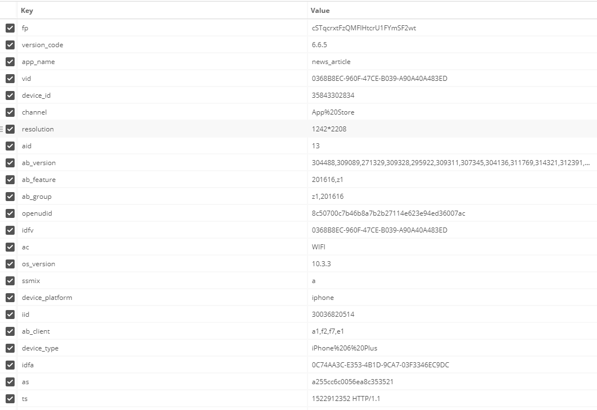

# 程序分成两个部分：haipproxy模块和chrome浏览器刷单模块
- haipproxy模块实现实时动态获取可用ip和端口满足刷单时对动态ip的需求。动态ip和端口数据保存在redis中。
- 刷单程序proxy_entry.py启动
后会自动代用chrome浏览器(windown需要配置bin下chromedriver.exe应用)，从redis获取到动态ip按照配置的参数启动多线程定时（一段时间内随机）刷新页面。
- 比较遗憾的是目前只能做到应用外刷单，还没有攻克应用内刷单的需求。
> haipproxy是在开源社区githup获取到的一个开源项目，做了一些改造而成的。

# 需要解决的问题：
### 阅读数
> IP段随机且分散于不同省份地区，时间均匀一点且每秒10次以上
### 正常速度的读完率
> 控制好机器阅读的速度（大概每秒15～20字）
### 转发数、评论数、点赞数
> 需要人工操作，不关机器的事

# 微信阅读数怎么算?
- 一、每个微信账号的ID一天只能提供5次阅读数，但是只可以点一次赞，即使你连续打开五次文章也是可以的。阅读数会增加，再多就不算了。
- 二、只计算微信app打开的文章，将文章链接转发到手机浏览器或PC浏览器均无效。
- 三、Web 版或 Mac 版微信打开的文章会跳转到 PC 浏览器，也不算数。微信文章在PC浏览器中是不显示阅读数的，也不显示“赞”数，手机浏览器同理。
- 四、贡献“阅读数”不需要关注公众号，聊天或朋友圈打开的文章均算数。只要在微信手机客户端里即可，除非第6条。
- 五、“阅读数”是实时的，不是(截止到)前一天的累计数据。在公开数据之前，公众号运营者可以在后台看到前一天的累计“阅读数”。
- 六、通过关键词自动回复功能获得的文章不计入阅读数。如果设定回复某关键词获得一个“图文消息”，这篇文章将从0开始计“阅读数”。

# 今日头条应用内阅读url抓包分析
### 应用内get一条新闻的url如下：
> http://a3.pstatp.com/article/full/19/2/6511216811021697540/6511216811021697540/2/0/0/?fp=cSTqcrxtFzQMFlHtcrU1FYmSF2wt&version_code=6.6.5&app_name=news_article&vid=0368B8EC-960F-47CE-B039-A90A40A483ED&device_id=35843302834&channel=App%20Store&resolution=1242*2208&aid=13&ab_version=304488,309089,271329,309328,295922,309311,307345,304136,311769,314321,312391,313902,304354,307807,295827,312375,239097,311780,170988,170989,306582,311208,316120,304236,281390,299982,297058,276206,286212,313219,313472,302830,257280,302274,302061,277769,310595,312538,304603,314341,304132,312587,314164,240867,280773,309603,307090,315112,315596,315140,313496,315208,315751,315433,258356,247850,280448,281300,310248,249045,315707,309751,315194,314554,312617,314401,296954,288418,290188,260652,310994,241181,316175,312361,271178,249828,246859&ab_feature=201616,z1&ab_group=z1,201616&openudid=8c50700c7b46b8a7b2b27114e623e94ed36007ac&idfv=0368B8EC-960F-47CE-B039-A90A40A483ED&ac=WIFI&os_version=10.3.3&ssmix=a&device_platform=iphone&iid=30036820514&ab_client=a1,f2,f7,e1&device_type=iPhone%206%20Plus&idfa=0C74AA3C-E353-4B1D-9CA7-03F3346EC9DC&as=a255cc6c0056ea8c353521&ts=1522912352 HTTP/1.1
### url参数分析
